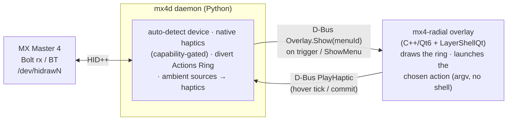

# mx-master-4-desktop

Bring the Logitech **MX Master 4**'s Windows-only features — the **Actions Ring**
radial menu and **native haptics** — to the Linux desktop, on **KDE Plasma 6** and
**LXQt**.

Logitech ships these features only through Logi Options+ on Windows 11 and macOS
([haptics announcement](https://support.logi.com/hc/en-us/articles/40581588219671-MX-Master-4-Native-Haptics-with-Windows-11)).
This project reimplements them natively on Linux — no Solaar dependency, no root
(beyond a one-time udev rule install).

> Status: **working end-to-end on real hardware.** The standalone raw-HID++
> daemon, the C++/Qt6 radial overlay, and their D-Bus integration are all built,
> tested, and proven on a real MX Master 4 + KDE Plasma 6 Wayland session. It also
> **coexists with Solaar** (Solaar owns the device; we still drive haptics + the
> ring) and stays fully self-sufficient when Solaar is absent.

## What it does

- **Radial menu ("Actions Ring")** — a circular pop-up menu summoned by the mouse's
  haptic touch panel (or programmatically over D-Bus), with the **auto-detected Task
  Manager / system monitor as the default center action**. Segments are
  user-configurable (launch app, switch desktop, media control, lock, custom
  command). Selection ticks the haptic motor as you move between segments, and a
  stronger tick confirms a commit.
- **Native haptics** — the mouse's haptic motor is driven directly over HID++ 2.0.
  Waveforms are **gated by the firmware's capability mask** (see Limitations) with an
  automatic fallback to the nearest supported waveform.
- **Ambient haptics** — the mouse buzzes in response to **desktop notifications,
  system sounds, and application-focus changes**, with a configurable waveform per
  event type and a global intensity level. Critical-urgency notifications get a
  distinct stronger waveform.
- **Desktops** — KDE Plasma 6 (Wayland + X11) and LXQt (X11). DE-agnostic core; thin
  per-DE behaviour for the overlay (center-screen on Wayland, at-cursor on X11) and
  focus events.

## Architecture

Two cooperating processes over the session D-Bus, sharing one INI config:



The daemon owns the HID connection and all policy; the overlay is a separate GUI
process so a UI crash never drops the HID link. They use **distinct** D-Bus names so
they co-run, and each gracefully no-ops if the other is absent.

| Process | Bus name | Object | Interface members |
|---|---|---|---|
| Daemon | `dev.usidiamond.mx4` | `/dev/usidiamond/mx4` | `PlayHaptic(s)->b`, `SetLevel(i)->b`, **`ShowMenu(s)->b`**, `GetCapabilities()->u`, `FocusChanged(s)->b`; signals `TriggerPressed()`, `TriggerReleased()`, `DeviceLost()` |
| Overlay | `dev.usidiamond.mx4.Overlay` | `/dev/usidiamond/mx4/Overlay` | `Show(s menuId)`, `Hide()`, `Commit(s actionId)->b`, `Activate(i index)->b`; signal `ActionChosen(s)` |

On an Actions-Ring press (or a `ShowMenu` call), the daemon ensures the overlay is
running — **lazily launching** it (config `[overlay] command`) if its bus name is
absent, waiting briefly and non-blockingly for the name to appear — then calls
`Overlay.Show(menuId)`. `ShowMenu` exposes that exact path over D-Bus so the
integration is testable without a physical panel tap.

More detail — including data-flow, threading, trigger and Solaar-coexist
**diagrams** — is in [docs/ARCHITECTURE.md](docs/ARCHITECTURE.md); the coding
conventions and how they are enforced are in
[docs/CODE_STANDARDS.md](docs/CODE_STANDARDS.md). See also
[daemon/README.md](daemon/README.md) and [overlay/README.md](overlay/README.md).

## Install

Requirements: Python 3.11+ with `python-dbus`, PyGObject (`gi`), and `python-Xlib`
in the **system** site-packages (the daemon runs on the system python — **no venv,
no pip at runtime**); Qt6 (Core Gui Qml Quick DBus) + LayerShellQt + CMake to build
the overlay.

```bash
packaging/install.sh                       # build + install under ~/.local
packaging/install.sh --enable-autostart    # …and start mx4d at every login
```

This is **idempotent** and **init-agnostic** — see **[docs/INSTALL.md](docs/INSTALL.md)**
for the full per-distro guide (Gentoo/OpenRC, Arch, Debian/Ubuntu, Fedora, and
from-source). It installs entirely under your home, except one `sudo` step for the
udev rule:

- builds the overlay + config GUI with CMake → `~/.local/bin/mx4-radial`, `mx4-config`
- copies the daemon package → `~/.local/lib/mx4desktop/mx4d/` + a `~/.local/bin/mx4d`
  launcher that sets `PYTHONPATH` and runs the system python's `python -m mx4d`
- installs a portable **XDG autostart** template (Exec=`mx4d`) → enable with
  `--enable-autostart` (only the daemon needs autostart; it lazy-launches the overlay)
- **detects the init system**: on systemd it *also* installs the systemd **user**
  units; on **OpenRC / runit / s6 / …** it relies on the XDG autostart entry and never
  calls `systemctl`
- **detects the desktop**: installs the KWin focus-bridge **only on Plasma**; on
  LXQt/X11 it is skipped (focus haptics are native there)
- installs the udev rule → `/etc/udev/rules.d/70-mx-master-4.rules` (**needs sudo** —
  the only privileged step; `TAG+="uaccess"`, scoped to Logitech VID `046d`, not
  world-writable; skip with `--no-udev`)
- writes a default `~/.config/mx4desktop/config.ini` if none exists

The installer **does not enable autostart** unless you pass `--enable-autostart`.
Start ad hoc:

```bash
# systemd:
systemctl --user start mx4desktop.service mx4-overlay.service
# OpenRC / no systemd user manager (this is what install.sh prints there):
mx4d --verbose &    # daemon; lazy-launches the overlay
# in either case the overlay can also be run by hand:
mx4-radial          # overlay (service mode); --demo shows the ring standalone
```

### Enable autostart (opt-in)

```bash
packaging/install.sh --enable-autostart                          # portable (any init)
# or, on systemd:
systemctl --user enable --now mx4desktop.service mx4-overlay.service
```

### Uninstall

```bash
packaging/uninstall.sh           # keeps your config
packaging/uninstall.sh --purge   # also removes ~/.config/mx4desktop/
```

Uninstall stops the daemon gracefully first, so its SIGTERM handler **restores the
Actions Ring panel to its native (non-diverted) state** before anything is removed.

## Configuration

One INI at `~/.config/mx4desktop/config.ini`, shared by the daemon and the overlay
(`center/command` is the same key both read). Created with sensible defaults on first
run; unknown keys are preserved on save.

```ini
[ambient]
enabled = true
quiet_hours = false
debounce_interval = 0.12

[source:notification]
enabled = true
waveform = HAPPY_ALERT     ; critical urgency upgrades to SHARP_COLLISION
intensity = 70
[source:focus]
enabled = true
waveform = SUBTLE_COLLISION
intensity = 40
[source:sound]
enabled = false            ; opt-in, coarse
waveform = DAMP_COLLISION
intensity = 50

[trigger]
divert_panel = auto        ; auto = capture the panel standalone (a tap and a hold
                           ; both summon the ring); under Solaar, listen passively
                           ; (divert the Haptic control in Solaar to use the panel).
                           ; true = force capture; false = listen-only
waveform = HAPPY_ALERT     ; buzz played when the ring opens
hold_threshold = 0.4       ; seconds; a press held longer counts as a "hold"
tap_menu =                 ; menu id a tap opens (empty = the default menu)
hold_menu =                ; menu id a hold opens (empty = the default menu)

[radial]
center/command = plasma-systemmonitor   ; auto-detected Task Manager (no shell)
center/label = Task Manager
center/icon = utilities-system-monitor
default_menu = default     ; menu id the daemon passes to Overlay.Show()

[overlay]
command = mx4-radial       ; how the daemon lazily launches the overlay
                           ; (bare name on PATH, or an absolute path for dev)
```

The radial **center action defaults to the auto-detected Task Manager**:
`plasma-systemmonitor` → `qps` / `lxtask` (LXQt) → `gnome-system-monitor` →
`ksysguard` → `xterm -e htop`, first present on `PATH`.

### Settings GUI

A portable Qt6/QML settings window (works on Plasma 6 **and** LXQt — no KF6
dependency) edits the same INI:

```bash
mx4-config            # or launch "MX Master 4 Settings" from the application menu
```

It edits every config surface — ambient master/quiet-hours/debounce, the three
sources (enable/waveform/intensity), the global haptic level, the trigger
(divert + waveform), the radial center action and segment list, and the overlay
command. It writes a **configparser-compatible** INI that both the daemon and the
overlay read, and **preserves unknown keys**. Per-waveform **Test** buttons play
the waveform live via `Daemon.PlayHaptic` (a graceful no-op, with a hint, when
the daemon is not running); when the daemon is running the GUI reads the firmware
**capability mask** (`Daemon.GetCapabilities`) and marks unsupported waveforms
`(not on this device)`.

### Native-Wayland focus (KWin script, opt-in)

`install.sh` also installs — but **never enables** — a small KWin script
(`mx4-focus-bridge`) that forwards active-window changes to the daemon
(`Daemon.FocusChanged(s)`), so focus haptics work for pure-Wayland clients that
do not surface via Xwayland `_NET_ACTIVE_WINDOW`. Enable it explicitly:

```bash
kwriteconfig6 --file kwinrc --group Plugins --key mx4-focus-bridgeEnabled true
qdbus6 org.kde.KWin /KWin reconfigure
# (or System Settings > Window Management > KWin Scripts)
```

## Proven (on real hardware, 2026-06-24)

Integrated end-to-end on a live KDE Plasma 6 Wayland session, with a real MX Master 4
on a Logi Bolt receiver:

- the daemon auto-detects the device (volatile `hidraw` node — never hardcoded),
  reads capability mask `0x0001003C`, captures the Actions Ring panel (standalone
  divert; under Solaar it listens for Solaar's divert instead), and publishes D-Bus;
- `Daemon.ShowMenu("default")` (the programmatic stand-in for a panel tap) **lazily
  launches the overlay** and the ring **appears** center-screen;
- hovering segments calls `Daemon.PlayHaptic(SUBTLE_COLLISION)` and **the mouse
  buzzes**; committing the center action plays a confirm tick (`COMPLETED` →
  capability-gated fallback to `HAPPY_ALERT`) and **launches `plasma-systemmonitor`**;
- `Hide()` hides the ring while the overlay stays **resident** for the next `Show`;
- on daemon `SIGTERM`, a panel **the daemon itself diverted is restored** (the
  standalone path) and the daemon-launched overlay is terminated — no leftover
  processes.

The haptic motor itself was retired as the core risk early on:

```bash
python3 tools/haptic_test.py            # plays a gentle waveform demo
python3 tools/haptic_test.py COMPLETED  # play one named waveform
```

## Limitations (honest)

- **Waveforms are firmware-gated.** The tested MX4's HAPTIC capability mask is
  `0x0001003C` — only `SHARP_COLLISION`, `DAMP_COLLISION`, `SUBTLE_COLLISION`,
  `HAPPY_ALERT`, and an undocumented `0x10` are supported; `COMPLETED`, `WAVE`,
  `JINGLE`, etc. are **silently ignored** by the firmware. The engine checks the mask
  and falls back to the nearest supported waveform. Other units may expose a different
  mask.
- **Wayland centers the ring; X11 anchors at the cursor.** A Wayland client cannot
  read the global cursor or place a surface at an absolute x,y, so on Plasma 6 the
  overlay appears **center-screen** (correct, not a bug). On X11/LXQt it appears **at
  the cursor**. Cursor-anchoring on Wayland would need a small KWin effect plugin
  (out of scope for v1).
- **Physical panel tap/hold is hardware-confirmed.** A tap and a press-and-hold of
  the haptic panel each summon the ring on real hardware (LXQt/X11, MX Master 4 over
  a Logi Bolt receiver), with the 0.4 s threshold cleanly separating the two. Under a
  running Solaar the divert must be owned by Solaar (set the *Haptic* control to
  *Diverted*); the daemon then listens passively and times the tap/hold. `ShowMenu`
  still exercises the full overlay path without a physical tap (the test seam).
- **Native-Wayland focus changes** are watched via X11 `_NET_ACTIVE_WINDOW` (covers
  Xwayland); a pure-Wayland client may not surface there. The optional
  `mx4-focus-bridge` KWin script (installed but **not** enabled by default — see
  *Native-Wayland focus* above) closes that gap by forwarding active-window changes
  to the daemon's `FocusChanged(s)`.

## Repository layout

```
daemon/        Python mx4d daemon (raw HID++, haptics, sources, trigger, overlay wiring)
overlay/       C++/Qt6 + LayerShellQt radial menu overlay
config-ui/     C++/Qt6 + QML settings GUI (mx4-config; no KF6)
packaging/     init-agnostic install.sh/uninstall.sh, XDG autostart, systemd user
               units, udev rule, KWin focus-bridge (Plasma-only), solaar/ helper
tools/         standalone raw-HID++ haptic smoke test
docs/          INSTALL.md (per-distro), ARCHITECTURE.md (+diagrams), RESEARCH.md,
               CODE_STANDARDS.md
```

## License

MIT — see [LICENSE](LICENSE).

## Acknowledgements

Builds on reverse-engineering by the [Solaar](https://github.com/pwr-Solaar/Solaar)
project (haptic feature `0x19B0`, `uaccess` udev pattern), and takes architectural
cues from [Kando](https://github.com/kando-menu/kando) (pie menu on KDE Wayland),
[koverlay](https://github.com/erik96/koverlay) (LayerShellQt overlay), and
[mx4notifications](https://github.com/lukasfri/mx4notifications) (notification-driven
haptics). Not affiliated with or endorsed by Logitech.
