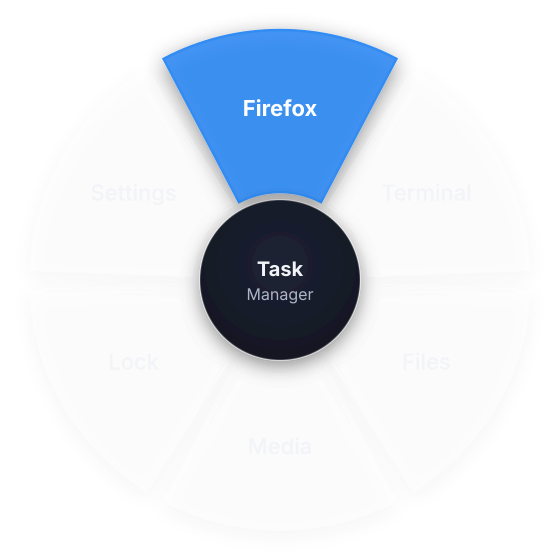
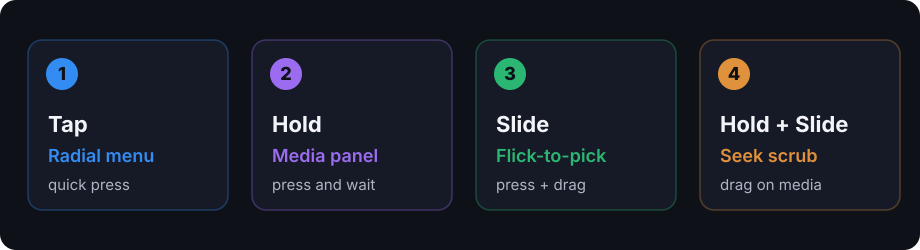

# MX Master 4 Linux Desktop

<p align="center">
  
</p>

Native **haptics** and the **Actions Ring** radial menu for the Logitech **MX Master 4**
on Linux — features Logitech ships only on Windows. Tap the thumb panel for a radial
menu, hold for media controls, slide to flick-pick, and feel the motor on
notifications and window focus. Works on **KDE Plasma 6** and **LXQt**.

> **Tested on** KDE Plasma 6 (Wayland) with an MX Master 4 on a Logitech Bolt receiver.
> The other distributions are packaged but not yet CI-verified — feedback welcome.

## Features

- **Actions Ring** — radial menu from the haptic thumb panel, with nested submenus
- **Flick-to-pick** — press and slide the thumb to aim a segment; release to run it
- **Media panel** — press-and-hold for MPRIS play/pause/seek, with thumb seek-scrub
- **Native haptics** — real motor feedback on notifications, window focus, and menu nav
- **No cloud, no root** — local daemon over HID++ 2.0; one udev rule is the only sudo

<p align="center">
  
</p>

## Install

A one-time udev rule needs `sudo`; everything else installs under `~/.local`.

```bash
git clone https://github.com/UsiDiamond/mx-master-4-linux-desktop
cd mx-master-4-linux-desktop
./install.sh                      # detects your distro, installs deps, builds, installs
./install.sh --enable-autostart   # …and start at every login (recommended)
```

The installer auto-detects the package manager. To manage deps yourself, add `--no-deps`.

| Distro | Dependencies |
|---|---|
| **Arch / Manjaro** | `sudo pacman -S --needed python python-dbus python-gobject python-xlib cmake ninja extra-cmake-modules gcc qt6-base qt6-declarative layer-shell-qt` |
| **Debian / Ubuntu** | `sudo apt install python3 python3-dbus python3-gi python3-xlib cmake ninja-build g++ pkg-config qt6-base-dev qt6-declarative-dev` |
| **Fedora** | `sudo dnf install python3 python3-dbus python3-gobject python3-xlib cmake ninja-build gcc-c++ extra-cmake-modules qt6-qtbase-devel qt6-qtdeclarative-devel layer-shell-qt-devel` |
| **Gentoo** | use the ebuild in `packaging/gentoo/` (or `./install.sh --no-deps` with the deps installed) |

Then build + install:

```bash
./install.sh --no-deps            # if you installed deps from the table above
```

Uninstall (restores the panel to its native state first):

```bash
packaging/uninstall.sh            # keeps your config
packaging/uninstall.sh --purge    # also removes ~/.config/mx4desktop/
```

## Usage

Once installed and started (autostart, or `mx4d &`):

| Gesture | Action |
|---|---|
| **Tap** the thumb panel | open the radial menu (pick with the mouse) |
| **Press + slide** | flick-to-pick — the highlight follows your slide; release to run |
| **Hold** | media panel (play/pause, next/prev, seek) |
| **Hold + slide** | scrub the seek bar |

Commands:

```bash
mx4-config      # settings GUI (sources, waveforms, radial menu, intensity)
mx4-radial      # run the overlay by hand; --demo shows the ring standalone
mx4d --verbose  # run the daemon in the foreground
```

### Enable flick / seek-scrub

The slide gestures need the mouse's raw-XY reporting, which is turned on by putting the
thumb panel in **Mouse Gestures** mode. In **Solaar** → this device → *Key/Button
Diversion* → set **Haptic** to **Mouse Gestures**. Tap/hold and haptics work without it.

## Configuration

Settings live in `~/.config/mx4desktop/config.ini` (created on first run) and are also
editable from the `mx4-config` GUI. Highlights:

```ini
[trigger]
hold_threshold = 0.4     ; seconds; longer press = "hold"
flick = true             ; slide-to-pick + seek-scrub
flick_start = 260        ; slide distance that distinguishes a flick from a tap

[radial]
center/command = plasma-systemmonitor   ; auto-detected Task Manager
default_menu = default

[source:focus]
enabled = true
waveform = SUBTLE_COLLISION
intensity = 40
```

A radial slot — or the center — can open another ring via a `submenu` key pointing at a
`[radial:<id>]` section; sub-rings get a **Back** hub automatically.

## Notes

- **Waveforms are firmware-gated.** The tested unit supports `SHARP_COLLISION`,
  `DAMP_COLLISION`, `SUBTLE_COLLISION`, `HAPPY_ALERT`; unsupported waveforms fall back to
  the nearest available. The settings GUI marks what your device supports.
- **Overlay placement** is at the cursor on X11 and center-screen on Wayland.
- **Plasma Wayland focus haptics** use an optional KWin script (`mx4-focus-bridge`,
  installed by `install.sh`); enable it in *System Settings → KWin Scripts*.

## License

MIT — see [LICENSE](LICENSE). Not affiliated with or endorsed by Logitech.
