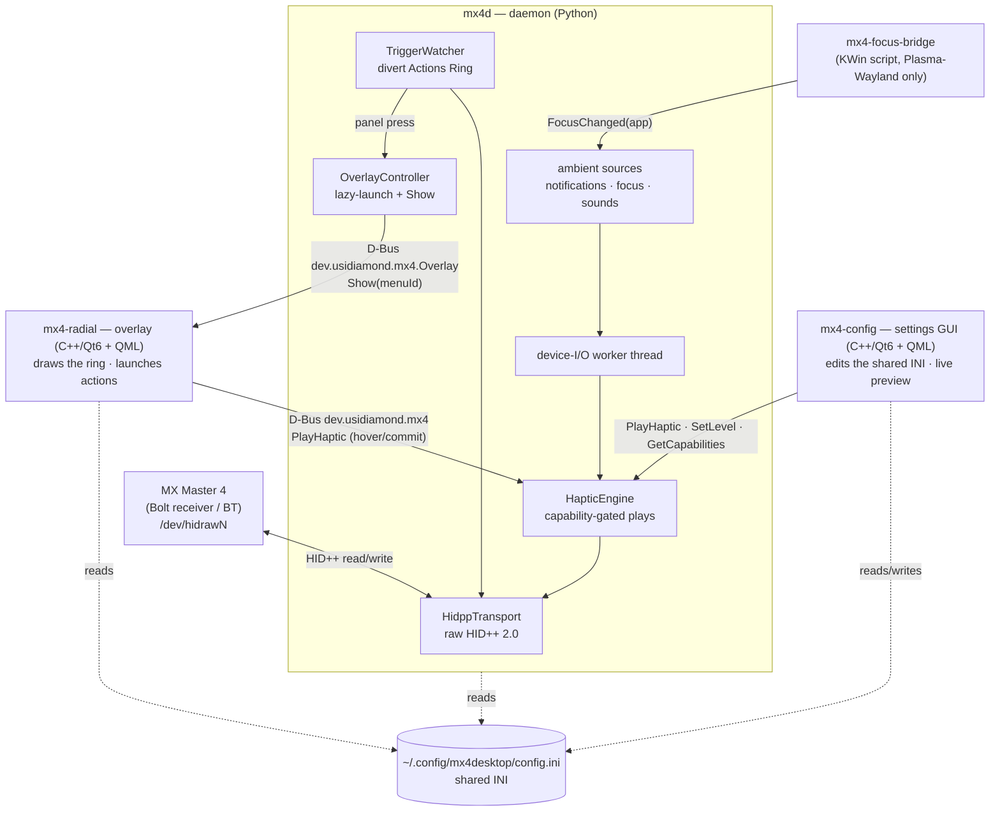
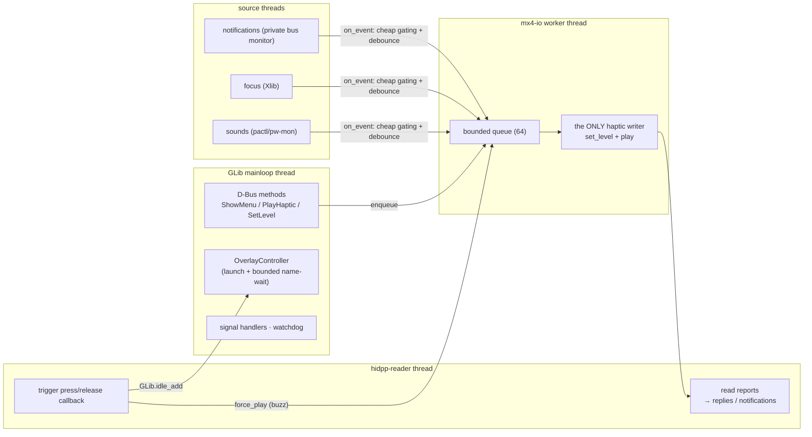
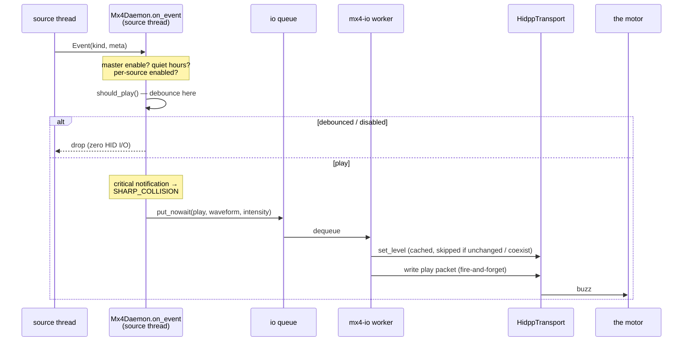
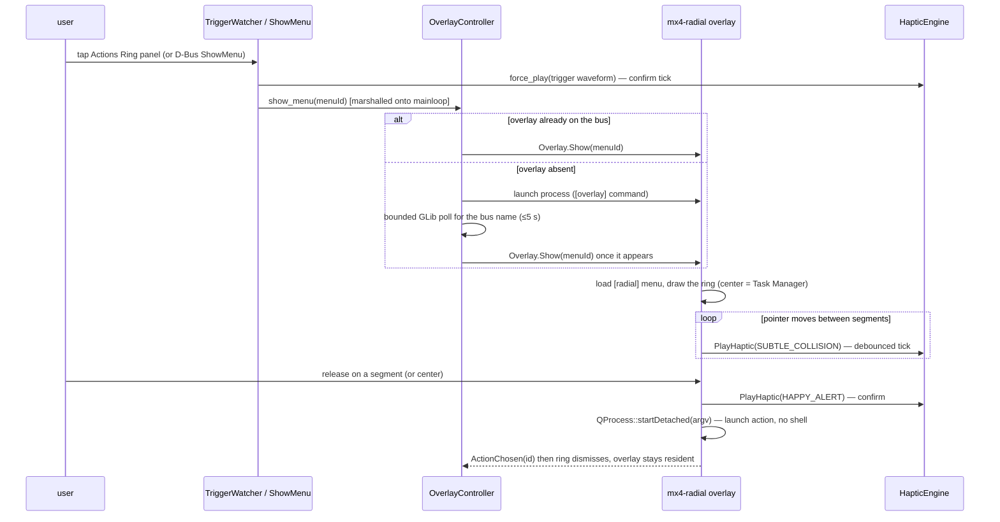
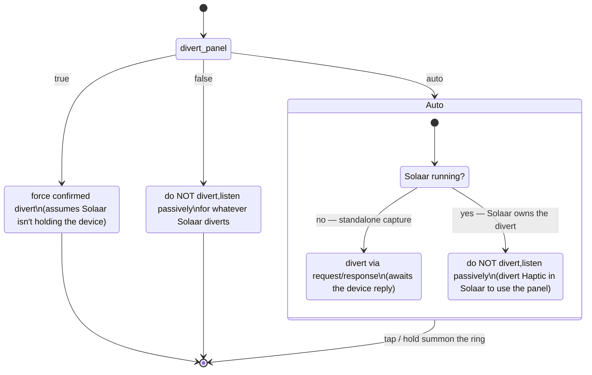

# Architecture

How `mx-master-4-desktop` is built, as shipped. Three cooperating pieces over the
session D-Bus, sharing one INI file, on top of a single raw-`hidraw` HID++ link.
Runs on **KDE Plasma 6** (Wayland + X11) and **LXQt** (X11); the device + haptics
core is desktop-environment agnostic.

For the device-level reverse-engineering this stands on (HID++ features, the
haptic packet, the trigger control), see [RESEARCH.md](RESEARCH.md). For the
coding conventions, see [CODE_STANDARDS.md](CODE_STANDARDS.md).

---

## 1. Components at a glance



Two processes, **distinct D-Bus names**, so they co-run and each gracefully
no-ops if the other is absent. The daemon owns the HID link and all policy; the
overlay is a separate GUI process so a UI crash never drops the device
connection (and so it can hold a Wayland surface the daemon should not).

| Piece | Language | Binary | Responsibility |
|---|---|---|---|
| **Daemon** | Python (system interpreter, no venv) | `mx4d` (`python -m mx4d`) | device, haptics, trigger, ambient→haptic, overlay control, D-Bus |
| **Overlay** | C++/Qt6 + QML + LayerShellQt | `mx4-radial` | draw the radial ring; launch the chosen action (argv, no shell) |
| **Config GUI** | C++/Qt6 + QML (no KF6) | `mx4-config` | edit the shared INI; live waveform preview; capability marking |
| **Focus bridge** | KWin script (JS) | `mx4-focus-bridge` | forward pure-Wayland focus changes to the daemon (opt-in, Plasma only) |

---

## 2. Module map

**Daemon — `daemon/mx4d/`**

| Module | Role |
|---|---|
| `hidpp.py` | the only code that touches the wire: HID++ 2.0 transport, request/response matching, background reader, feature resolution via ROOT |
| `device.py` | locate the MX Master 4 (scan receivers, match name) + the Solaar-coexist bind path; resolve feature indices |
| `haptics.py` | `HapticEngine` — capability gating, level get/set, the proven fire-and-forget play packet, debounce |
| `trigger.py` | `TriggerWatcher` — divert the Actions Ring panel (`0x1B04`), decode press/release, **always restore** on stop |
| `daemon.py` | wires it all together under a GLib mainloop; the device-I/O worker; the session D-Bus object |
| `overlay.py` | `OverlayController` — lazy-launch the overlay and call `Show`, never blocking the mainloop |
| `config.py` | typed view over the INI; defaults; task-manager auto-detection; configparser-compatible save |
| `solaar.py` | dependency-light `/proc` scan: is a long-lived Solaar background app running? |
| `sources/` | ambient event producers: `notifications.py`, `focus.py`, `sounds.py` |

**Overlay — `overlay/src/`**

| Unit | Role |
|---|---|
| `main.cpp` | app wiring; per-`Show` recreates the `QQuickView` so the Wayland surface role is fresh |
| `OverlayService` | the `dev.usidiamond.mx4.Overlay` D-Bus surface (`Show`/`Hide`/`Commit`/`Activate`) |
| `RadialController` | QML-facing model: segments, highlight from pointer angle / keyboard, commit → launch |
| `MenuConfig` | load the `[radial]` menu from the shared INI (or a built-in default) |
| `PlatformWindow` | backend setup: LayerShellQt (Wayland), at-cursor `Qt::Tool` (X11), or fallback |
| `DaemonHaptics` | thin QtDBus client that asks the daemon to buzz on hover/commit |

**Config GUI — `config-ui/src/`**: `ConfigModel` (read/write the shared INI, preserving unknown keys), `DaemonBridge` (live preview + capability mask), `main.cpp`.

---

## 3. D-Bus contract

Two services on the session bus. **Changing one side requires changing the
other** — these signatures are the integration contract.

| Process | Bus name | Object | Members |
|---|---|---|---|
| Daemon | `dev.usidiamond.mx4` | `/dev/usidiamond/mx4` | `PlayHaptic(s)→b`, `SetLevel(i)→b`, `ShowMenu(s)→b`, `GetCapabilities()→u`, `FocusChanged(s)→b`; signals `TriggerPressed()`, `TriggerReleased()`, `DeviceLost()` |
| Overlay | `dev.usidiamond.mx4.Overlay` | `/dev/usidiamond/mx4/Overlay` | `Show(s menuId)`, `Hide()`, `Commit(s actionId)→b`, `Activate(i index)→b`; signal `ActionChosen(s)` |

`ShowMenu` exposes the exact panel-press path over D-Bus, so the full
show → hover → commit → launch chain is testable **without a physical tap**
(`Commit`/`Activate` likewise drive the overlay programmatically on Wayland).

---

## 4. Threading model

The daemon is a single process with several threads. The invariant:
**blocking HID I/O never runs on the mainloop, and D-Bus/overlay work never runs
off it.**



- **`mx4-io` worker** owns *every* haptic write. A notification storm is
  debounced **before** it reaches the queue, so a burst issues zero HID
  round-trips; the queue is bounded so sustained storms coalesce by dropping.
- **`hidpp-reader`** classifies each report as a reply (routed to the waiting
  caller by `(device, feature, function, software-id)`) or an unsolicited
  notification (dispatched to callbacks). The trigger callback runs here and
  marshals overlay/D-Bus work onto the mainloop with `GLib.idle_add`.
- A **watchdog** on the mainloop notices if the reader dies (device unplugged)
  and shuts down cleanly instead of lingering as a zombie.

---

## 5. Ambient event → haptic



Sources and their mechanisms (all degrade gracefully — a missing dependency
disables just that source):

| Source | Mechanism | Default waveform |
|---|---|---|
| **Notifications** | passive monitor of `org.freedesktop.Notifications.Notify` on a **private** bus connection (or a `dbus-monitor` subprocess fallback); urgency 2 → stronger | `HAPPY_ALERT` → critical `SHARP_COLLISION` |
| **Focus change** | X11 `_NET_ACTIVE_WINDOW` via Xlib (covers Xwayland); pure-Wayland via the optional KWin `FocusChanged` bridge | `SUBTLE_COLLISION` |
| **System sounds** | `pactl subscribe` / `pw-mon` new playback stream (coarse; **off by default**) | `DAMP_COLLISION` |

> The notifications monitor MUST use a **private** D-Bus connection.
> `BecomeMonitor` turns a whole connection receive-only; doing it on the shared
> session bus would silently destroy the daemon's own `dev.usidiamond.mx4`
> service name.

---

## 6. Summoning the ring (trigger → overlay → action)



**Summoning the ring:**

1. **Panel tap / hold (primary).** Once the Actions Ring panel (`0x1B04`, CID
   `0x01A0`) is diverted, the daemon distinguishes a **tap** from a
   **press-and-hold** (threshold `[trigger] hold_threshold`); each summons a
   configurable menu (`tap_menu` / `hold_menu`, both the default ring by
   default) — a Solaar *rule* can't tell a tap from a hold, which is why the raw
   events are needed. **Standalone** the daemon owns the divert itself; **under
   Solaar** Solaar must own the divert (set the *Haptic* control to *Diverted*)
   and the daemon listens passively — see §7.
2. **`mx4-show`** — a tiny `dbus-send` wrapper (`packaging/bin/mx4-show`) calling
   `Daemon.ShowMenu`; bind it to any keyboard/mouse shortcut.
3. **D-Bus `ShowMenu(menuId)`** — the programmatic entry the others use, and the
   test seam (no physical tap needed).

---

## 7. Solaar coexistence (the `divert_panel` tri-state)

The project is **Solaar-first with a self-sufficient standalone fallback**: the
standalone path never hard-depends on Solaar; Solaar integration is purely
additive. When Solaar runs it owns the receiver as the registered HID++
software, so our **request/response** probes (detection, capability read,
`set_level`) get a broken pipe — but fire-and-forget **writes** and passive
**notification reads** still work. Two consequences:

* **Haptics** in coexist do **no probing**: the daemon takes the
  (firmware-stable, env-overridable) device coordinates as given and plays
  writes-only, against a preset capability mask.
* **The trigger** divert is a *settings* change, not a one-shot command — and on
  this firmware it does **not** land via a fire-and-forget write while Solaar
  holds the device (verified on hardware: the control stays `Regular`, so no
  `divertedButtonsEvent` is emitted). So in coexist the daemon does **not** try
  to divert; it **listens passively**. The divert must be owned by Solaar — set
  the *Haptic* control to *Diverted* (Key/Button Diversion). The kernel then
  broadcasts the press/release notifications to *every* reader of the hidraw
  node, so the daemon hears them and runs its own tap/hold timer.



`true`/`false` keep their legacy bool meaning. `auto` (the default) captures the
panel **only standalone**; under Solaar it listens passively (Solaar owns the
divert). In **all** cases the daemon still does haptics + ambient mapping +
overlay control, and the daemon never leaves a panel **it** diverted still
diverted at shutdown (the standalone capture path restores on stop).

---

## 8. Configuration — one shared INI

`~/.config/mx4desktop/config.ini` (honoring `XDG_CONFIG_HOME`) is read by all
three programs. It is a **contract**: the daemon parses it with Python
`configparser`; the overlay and config GUI use Qt `QSettings`. Because
`QSettings`'s INI *writer* escapes section names and uses `\` subgroup
separators (which `configparser` cannot read), the config GUI **hand-emits** a
configparser-compatible INI (literal `:` in section names, literal `/` in keys)
and **preserves unknown keys** on save.

```ini
[ambient]
enabled = true          ; master switch for ambient haptics
quiet_hours = false
debounce_interval = 0.12

[source:notification]   ; + [source:focus], [source:sound]
enabled = true
waveform = HAPPY_ALERT  ; critical urgency upgrades to SHARP_COLLISION
intensity = 70

[trigger]
divert_panel = auto     ; auto (defer to Solaar if running) | true | false
waveform = HAPPY_ALERT  ; played on a trigger press

[radial]
center/command = plasma-systemmonitor  ; auto-detected Task Manager (no shell)
center/label = Task Manager
center/icon = utilities-system-monitor
default_menu = default
count = 6               ; + 1/id, 1/label, 1/icon, 1/command … per segment

[overlay]
command = mx4-radial    ; how the daemon lazily launches the overlay
```

The radial **center action defaults to the auto-detected Task Manager**:
`plasma-systemmonitor` → `qps` → `lxtask` → `gnome-system-monitor` →
`ksysguard` → `xterm -e htop`, first present on `PATH`. The daemon, overlay and
config GUI use the **same ordered candidate list** so all three agree.

---

## 9. Per-desktop behaviour

| Concern | Plasma 6 Wayland | Plasma 6 / LXQt X11 |
|---|---|---|
| Overlay surface | LayerShellQt `LayerOverlay`, keyboard `OnDemand`, **center-screen** (Wayland can't read the cursor or place absolutely) | frameless `Qt::Tool`, top-most, **at the cursor** |
| Focus events | Xwayland via `_NET_ACTIVE_WINDOW`; pure-Wayland via opt-in `mx4-focus-bridge` | native `_NET_ACTIVE_WINDOW` (complete) |
| Init | systemd user units *or* XDG autostart | XDG autostart (no `systemctl --user` on OpenRC/runit/s6) |

The installer is **init-agnostic** (XDG autostart primary; systemd user units
additionally on systemd) and installs the KWin focus-bridge **only on Plasma**
(never enabled automatically).

---

## 10. Gotchas (hard-won; don't relearn)

- **Firmware gates waveforms.** The tested unit's mask is `0x0001003C` — only
  `SHARP/DAMP/SUBTLE_COLLISION`, `HAPPY_ALERT`, and an undocumented `0x10`.
  `COMPLETED`, `WAVE`, `JINGLE`, … are silently ignored. Always gate + fall back.
- **`hidraw` node numbers are volatile** across reboots/re-pairing — never
  hardcode them; the daemon auto-detects (or reads the node from Solaar in
  coexist mode). `MX4_HIDRAW` / `MX4_DEVICE_INDEX` override deterministically.
- **`BecomeMonitor` on the shared bus is fatal** — it makes the connection
  receive-only and kills the daemon's own bus name. Use a private connection.
- **All blocking HID I/O must leave the GLib mainloop** (the device-I/O worker),
  or notification dispatch stalls and `set_level` times out.
- **Solaar contention is asymmetric:** request/response gets a broken pipe under
  a running Solaar, but fire-and-forget writes and passive reads coexist fine —
  this is exactly what coexist mode exploits.
- **The Solaar `haptic-play` CLI is broken** (`TypeError: Unable to marshal str
  as an array`) — irrelevant to us; we send the raw packet.
- **Wayland overlay must be window type `toolbar`** (not `dock`) or it receives
  no keyboard (Escape-to-dismiss breaks).
- **Trigger-divert restore on shutdown may need a retry** — attempt 1 can time
  out; attempt 2 succeeds, then a fire-and-forget last resort. The panel always
  ends up non-diverted.

---

## Out of scope (v1)

- Driving the mouse's *internal* on-device Actions Ring (undecoded; would need a
  Windows USB capture). We render our own overlay instead.
- Custom/arbitrary haptic waveforms — firmware exposes only the pre-baked set
  plus a global 0–100 level.
- Cursor-anchoring the overlay on Wayland — needs a small C++ KWin effect plugin
  to expose the cursor position (the Kando pattern); center-screen for now.
